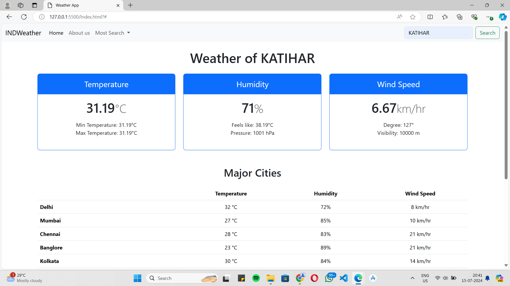
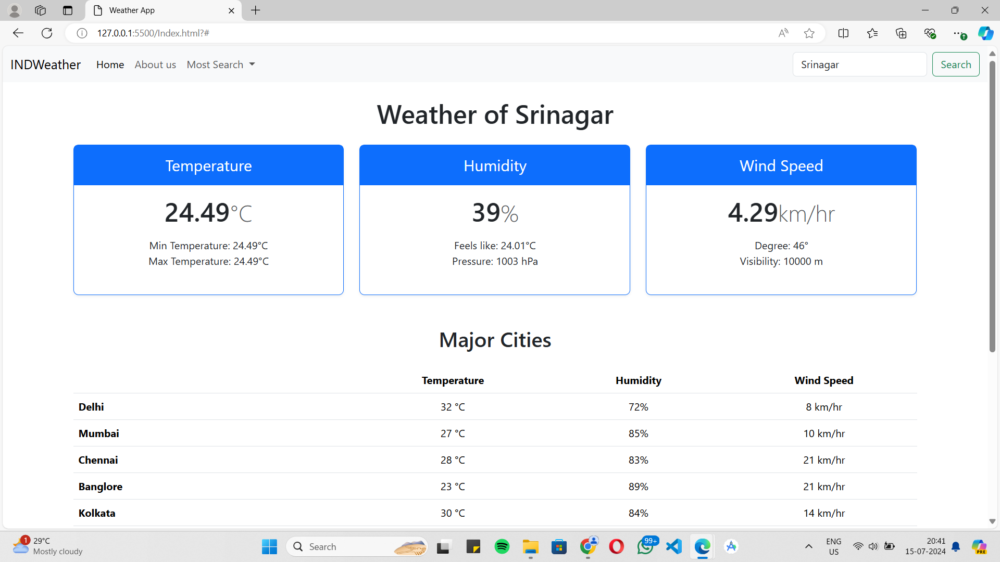

# INDWeather





INDWeather is a simple web application that provides weather information for various Indian cities. The application fetches weather data from a weather API and displays the current temperature, humidity, wind speed, and other weather-related information.

## Features

- Search for weather information by city name.
- View weather details including temperature, humidity, wind speed, and more.
- Smooth scrolling to the "About Us" section.
- Display weather information for major cities in India.

## Technologies Used

- HTML
- CSS (Bootstrap 5.3.3)
- JavaScript (Vanilla JS)
- [Open Weather API](https://rapidapi.com/open-weather-map/)

## Getting Started

Follow these instructions to get a copy of the project up and running on your local machine.

### Prerequisites

- A modern web browser (Google Chrome, Mozilla Firefox, etc.)
- An internet connection to fetch weather data from the API.
- A code editor (Visual Studio Code, Sublime Text, etc.)

### Installation

1. Clone the repository:

```bash
git clone https://github.com/your-username/indweather.git

2. Navigate to the project directory:
    bash
cd indweather

3. Open the index.html file in your web browser:
    bash
open index.html


### API Key

The application uses the Open Weather API to fetch weather data. You need to replace the placeholder API-key with your own API key.

Sign up at RapidAPI and subscribe to the Open Weather API.
Obtain your API key from the RapidAPI dashboard.
Open script.js and replace 'API-key' with your actual API key.

### Acknowledgments

Bootstrap for the responsive design framework.
Open Weather API for providing the weather data.

[def]: images/screenshot3.png